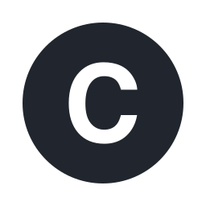

 
 <h3>Confirma</h1>
 
A lightweight and intuitive unit testing tool for the Godot game engine.

> [!NOTE]
> This project is in early stage of development.

## Prerequisites

- [.NET SDK 7^](https://dotnet.microsoft.com/en-us/download)
- [.NET enabled Godot 4^](https://godotengine.org/download)
- C# 11^

## Overview

### Features

- Writing and executing tests in C# and GDScript
- Custom assertion library (over 130 assertions)
- Extensions for Random class
- Independent of Godot editor (but can be accessed from Godot)
- Simple syntax for writing tests
- Parametrized tests
- Parallelized tests
- JSON output

## Setup

See the [setup guide](./docs/SETUP.md).

## Documentation

See the [docs](./docs/) folder.

## License

Licensed under [MIT license](./LICENSE).
