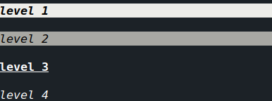
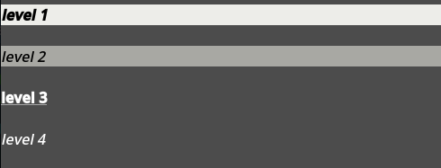
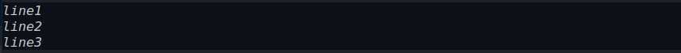

# Help pages structure
**Overview of JSON format**

[full structure](resources/help_page_structure.json)
---
file base template:

```json
{
    "version": 1,
    "data":[]
}
```
---

## text
- **text**: (string)
- **color**: (html color)
- **bg_color**: (html color)
- **format**:
    - **bold** (**b**)
    - **underline** (**u**)
    - **italic** (**i**)
    - **Strikethrough** (**s**)
    - **fill** (**f**)
    - **center** (**c**)
## header
- **text**: (string)
- **level** (1-4)

### example:
#### terminal:

#### godot:

```json
"data":[
    {
        "type":"header",
        "text":"level 1",
        "level":1
    },
        {
        "type":"header",
        "text":"level 2",
        "level":2
    },
        {
        "type":"header",
        "text":"level 3",
        "level":3
    },
        {
        "type":"header",
        "text":"level 4",
        "level":4
    }
]
```
## link
- **text**: (string)
- **url**: (valid url)

### example:
#### terminal:

#### godot:

```json
"data":[
    {
        "type":"link",
        "text":"text",
        "url": "https://example.com"
    }
]
```
## code
- **lines** (array of strings)

### example:
#### terminal:

#### godot:

```json
"data":[
    {
        "type":"code",
        "lines":[
            "line1",
            "line2",
            "line3"
        ]
    }
]
```

